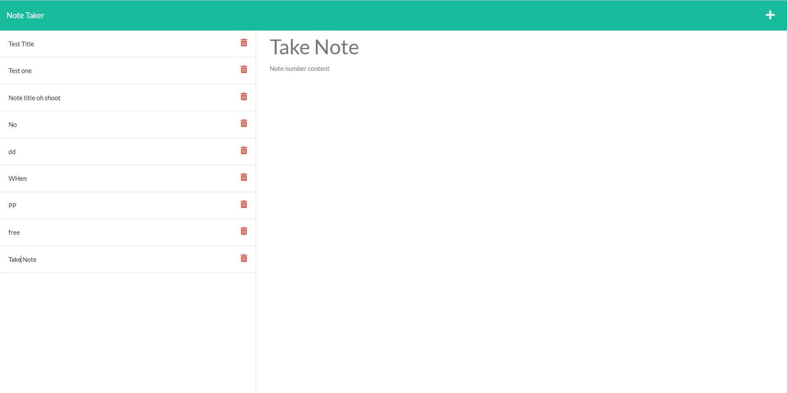

 
Note Taker
Motovation:
My motivation in creating this project is to create a type of note taking website that logs what notes you have taken for you to view at later dates.
This is a great way to keep notes on your computer. Definitely can be used as a quick note taking platform for people.
I learned a lot about how databases can react with a javascript file and how to edit and locate files from other directories.
 
One thing I had a lot of trouble with was the delete function. I simply could not get the system to find the id of the note that I wanted to delete.

Usage:
This is a simple task to use, you simply click on the button note take on the center of the screen and that will take you to the note page. From there if you text in the Note Title area this will be your note name. Type in the Note Text area and that will have your notes content. Once you have typed content into both sections, a save icon will appear in the top right next to the plus sign, you will click this to save the note and it will clear your text and save the note on the left of the page. If you want to view your note, click on the text of the name of the note and the note will appear where you type, you are able to modify it from there.

Screenshot 

Video:
(Note this will take you to a new page)

